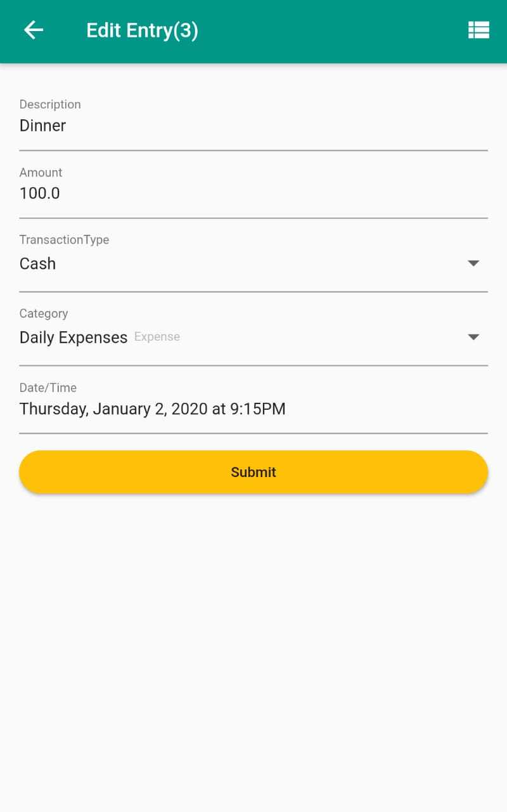
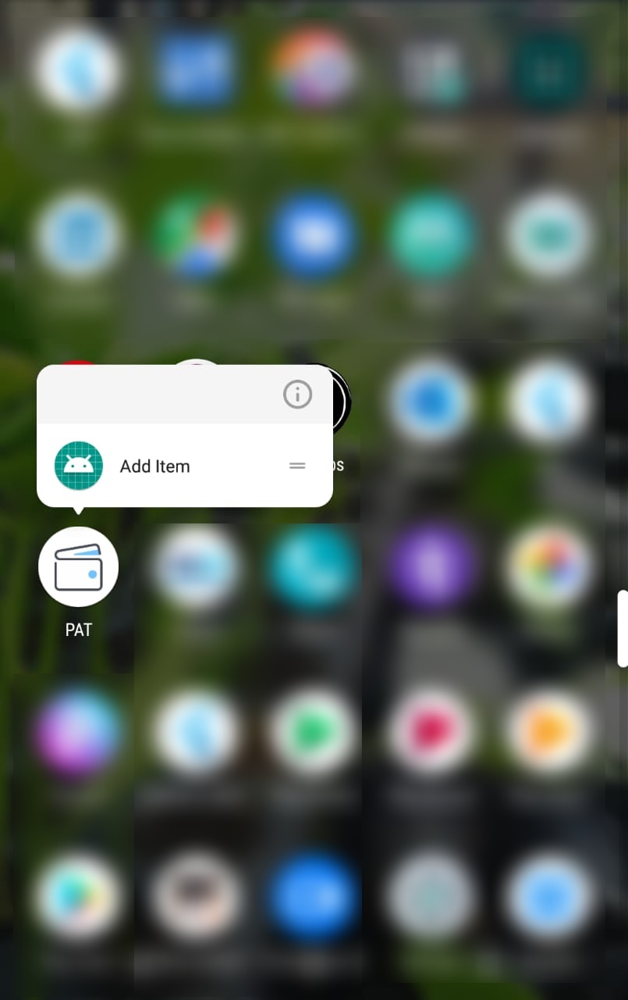

## PAT_flutter - Hari

### Screenshots

   

# Based on Awasome guide of https://github.com/AndriousSolutions

# Flutter Plugin Details:
   - https://github.com/flutter/plugins

# Tutorial Pages

   - [A curated list of samples](https://github.com/flutter/samples/blob/master/INDEX.md)

   - [Flutter Create winners 2018](https://medium.com/flutter-io/the-flutter-create-winners-are-40980f2d20b3)

   - [DateTimeItem Widget](https://www.woolha.com/tutorials/flutter-date-time-datetime-picker-input-example)

   - [File operations - Crud](https://www.woolha.com/tutorials/flutter-reading-and-writing-files-example)

   - [Quick Action Shortcuts](https://medium.com/flutter-community/quick-actions-in-flutter-c455caa4f2ba)

   - https://kodestat.gitbook.io/flutter/

   - https://www.flaticon.com/free-icon/

   - http://androidkt.com/flutter-alertdialog-example/

   - https://flutteropen.gitbook.io/ebook/widgets-13-or-dropdownbutton
   
  SQFlite Account URL :

	- https://medium.com/@greg.perry/flutter-and-sqlite-f72878bc5859

	- https://gist.github.com/Andrious/feb05d140fbed5f98945ea706edab137#file-main-dart-L65

  Dropdownlist sqllite:

	- https://inducesmile.com/google-flutter/how-to-populate-dropdownbutton-using-sqlite-database-in-flutter/

  Query:

	-http://www.sqlitetutorial.net/sqlite-foreign-key/

  Datetime:

	- http://www.sqlitetutorial.net/sqlite-date/

Git Clone by branch:
-------------------

	git clone https://balahariprasath@bitbucket.org/daikanpheonix/pat_flutter.git -b hpat_flutter

   cd pat_flutter

   flutter packages get

# Flutter Installation

Step - 1:
--------

   Install Android studio latest version

Step - 2: 
---------

   Install Open-JDK by using following command

	sudo apt install openjdk-8-jre openjdk-8-jdk        
   
   or
   
    sudo apt-get install default-jdk

Step - 3:
---------
   
   Set the Environment Variables in .bashrc file.

   Add Following Lines:

    # Android SDK path
	export ANDROID_HOME=$HOME/Android/Sdk
	export PATH=$PATH:$ANDROID_HOME/emulator
	export PATH=$PATH:$ANDROID_HOME/tools
	export PATH=$PATH:$ANDROID_HOME/tools/bin
	export PATH=$PATH:$ANDROID_HOME/platform-tools
	export PATH=$PATH:/opt/gradle/gradle-5.2.1/bin
	# Flutter Path
	export PATH=$PATH:/home/hari/workspace/flutter/flutter/bin

   optional:

   	* If you are install default-jdk then no need to add following JAVA PATH 

    # JAVA PATH
    export JAVA_HOME=/usr/lib/jvm/java-1.8.0-openjdk-amd64/
    export PATH=$PATH:JAVA_HOME
   
Step - 4:
--------

   Clone the Fultter Framework by using following command:

    git clone -b master https://github.com/flutter/flutter.git

Step - 5:
---------

   Install dart SDK by following command
   
    cd flutter_path
    cd bin
    ./flutter --version
   
   This will install the Dart SDK

   * Dependencies for Flutter

		sudo apt-get install lib32stdc++6

   * Add Android licenses

    	flutter doctor --android-licenses

   * Install flutter Plugins in Android Studio and visual studio

   		* In visual Studio:

   			`Extentions -> Search -> flutter -> Install Flutter Extension`

   		* In Android Studio:

   			`File -> Settings -> Plugins -> Search -> flutter -> Install Flutter Plugin`

Step - 6:
-----------
   
   Setup the Flutter Global access point by adding the flutter in root by set Environment varibale
    
	sudo nano ~/.bashrc
   
   Adding the following line:
   
    export PATH=$PATH:/home/saasmate/BALAWRK/Flutter/flutter/bin

Step - 7:
---------

   Install all the Flutter Dependecies by using following command

    flutter doctor

Step - 8:
---------

   Create the Flutter Project by using following command

	cd wokspace

	flutter create project_name

Step - 9:
---------

   Run the Flutter project

	flutter run

# Note:
   
   * Before run the above command you should connect android device or any anroid emulator to the System.
